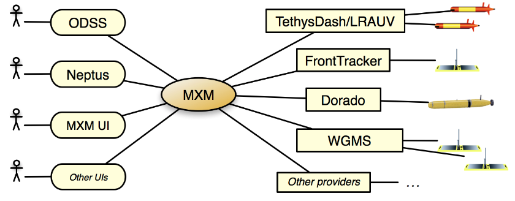

# Mission Execution Mediation Service

!!! danger "Note"
    This documentation site is WIP, being initially constructed from materials captured in the following:

    - [Mission Execution Mediation Service (MXM) – Goals, Use Cases, and Design](
      https://docs.google.com/document/d/1Fx8C92x4uB9dCx9SH7cpCscn8LqSZywyYm47y8TKDJY/)
    
    - [Mission Execution Mediation Service (MXM) – Prototype Implementation](
      https://docs.google.com/document/d/1aaYhCVzL0YrlpRZhPJZWhIbcjFDoz1AkzsIIs4NgIY8/edit)
    
    - Other docs under this [Google Docs folder](
      https://drive.google.com/drive/u/0/folders/1L8qDvzkK2ywEq0tjoFq32syVHc47Wmby)

## Introduction

The Mission Execution Mediation Service (MXM) effort seeks to provide a set of programmatic and user interfaces to
integrate mission information across diverse mission execution systems at MBARI, as well as to support the integration
of third-party applications, in particular to facilitate extended planning capabilities on MBARI assets.

As a mediation service, MXM basically sits between the users and operators on one end, and the external systems that
manage concrete programmable assets on the other end:

The right-hand side of the figure shows some possible mission execution systems that can be integrated in the MXM
framework. With support from the MXM service, the left hand side shows how mission information (for example, from the
LRAUV) can be exposed through the ODSS interface so users can not only visualize the most recent positions of the
assets (which is currently supported with the underlying tracking database in the ODSS), but also learn about the status
of the ongoing missions and even about the missions that are being scheduled. With appropriate programmatic interfaces
as proposed in this document, a similar set of features will be supported for all other execution systems that are
integrated in the framework.

The proposed MXM interfaces will support a unified view of the information in terms of available mission definitions,
parameterization, scheduling, and execution status. For operators and end-users in general, a key goal is to facilitate
mission coordination among the various execution systems using a uniform set of tools and graphical components. For
developers and maintainers of existing and new mission execution systems, the MXM effort aims at providing APIs and
interaction protocols to facilitate integration while reducing code duplication, and, ultimately, support the mentioned
key goal for end-users. We will also enhance the ODSS as well as provide an integrated web application on top of the
central MXM service. This integrated web interface will initially help with the development of the MXM framework itself,
and complement, not replace, any GUI of existing execution systems.

In the first part of this document, we describe the goals, key use cases, as well as the system integration mechanisms
in the envisioned MXM framework. In a second part, we describe the logical data model and the APIs. The integration
capabilities are described in an API-driven but implementation-independent fashion.

### MXM Goals

The main goals of the MXM project are:

- Provide a central mediation service for definition and execution of mission plans against registered execution
  systems;
- Significantly improve user interfaces for definition, editing, and validation of missions;
- Provide a unified view of mission information across the various systems to facilitate mission coordination and
  decision-making;
- “Factor out” and extend common functionality in various existing systems regarding mission parameterization and
  execution (ODSS, LRAUV/TethysDash, TSAUV Front Tracking, Dorado, UAV’s);
- Facilitate interoperability with external tools and applications for enhanced mission definition and visualization
  capabilities as well as expanded sharing of execution information (Neptus, WGMS / LEO, Geomar Navigator, ROS).
 
## Use Cases
               
### Use Case: Integrated Mission View

### Use Case: High-level Planning

### Use Case: Mission Planning Refinement

### Use Case: Mission Scheduling

## System Integration

### ODSS Integration

### TethysDash Integration

### External Tool Integration
