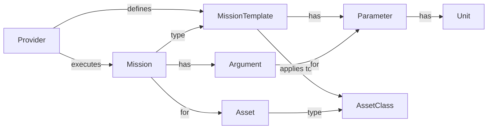

[//]: # (hmm mermaid's erDiagram is not very nice)

WiP

```mermaid
flowchart LR
  Provider        -->|defines| MissionTemplate;
  MissionTemplate -->|has| Parameter;
  MissionTemplate -->|applies to| AssetClass;
  Parameter       -->|has| Unit;
  Mission         -->|has| Argument;
  Provider        -->|executes| Mission;
  Argument        -->|for| Parameter;
  Asset           -->|type| AssetClass;
  Mission         -->|for| Asset;
  Mission         -->|type| MissionTemplate;
```

