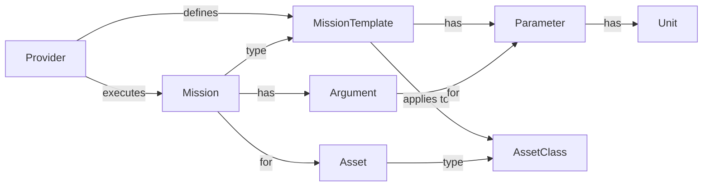

[//]: # (hmm mermaid's erDiagram is not very nice)

WiP

## Provider

This represents the central entity in the data model regarding provider information. As such it primarily (i) indicates
the mission templates and assets that it handles, and (ii) supports the execution of particular missions defined
according to associated mission templates. TethysDash/LRAUV is an example of a provider that can be
represented in the MXM system.

## MissionTemplate

Defines a particular mission template as supported by a particular provider. A mission template applies to assets of
particular asset classes and has associated parameters. The "Science/sci2" mission script is an example of a mission
template associated with the TethysDash/LRAUV provider.

## AssetClass

Defines a family of assets that can be associated with a mission template. In the TethysDash/LRAUV case, "LRAUV" is the
asset class associated with all mission templates in that system.

## Asset

Indicates a particular instance of an asset class. "Daphne" and "Makai" are examples in the TethysDash/LRAUV system,
both of which are instances of the "LRAUV" asset class.

## Parameter

A parameter indicates a particular input parameter in a mission template. Parameter attributes include name, type, units
of measure, and optional default value. As an example, MissionTimeout is one of the parameters associated with the
"sci2" mission template in TethysDash/LRAUV.

## Mission

A mission is a particular instantiation of a mission template. Its purpose is to represent a concrete planned (and
eventually executed) mission. A mission indicates the particular target asset (e.g., "Daphne"), and the concrete
parameter values (either default values or explicitly indicated values via arguments –see below) according to the
corresponding mission template.

## Argument

An argument in a mission captures a particular value for a parameter, either to override its default value (if any) or
to provide a value for a required or optional parameter.

## Unit

Defines a unit of measure for a parameter. 

