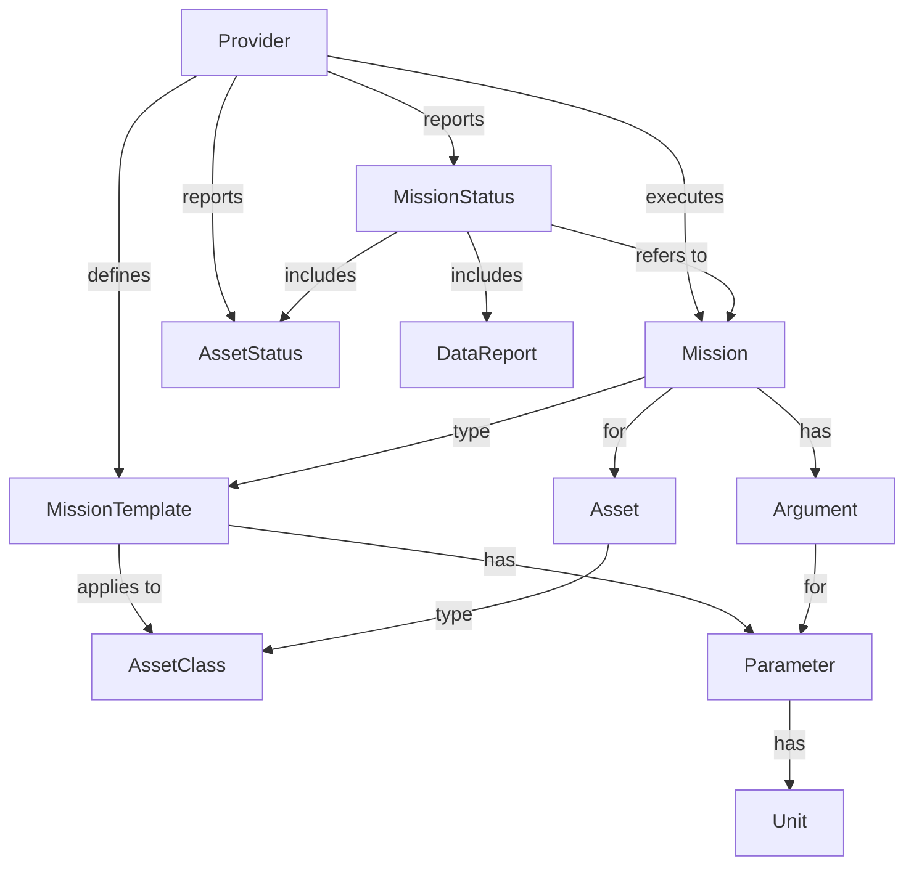

[//]: # (hmm mermaid's erDiagram is not very nice)

WiP



## Provider

This represents the central entity in the data model regarding provider information.

- indicates the mission templates and assets that it handles
- supports the execution of particular missions defined according to associated mission templates
- reports the status of submitted missions

Example provider: TethysDash/LRAUV.

## MissionTemplate

Defines a particular mission template as supported by a particular provider.

A mission template:

- applies to assets of a particular asset class
- has associated parameters

Example: The "Science/sci2" mission script in the TethysDash/LRAUV system.

## AssetClass

Defines a family of particular assets that can be associated with a mission template.

!!! note
    In the model, all asset classes and assets are defined as a common resource for all providers.
    In the future, we envision this common resource to either be kept in sync with or 
    directly refer to the entities defined in the TrackingDB system or similar,
    where an authoritative definition of such asset classes and assets is in place.

Example: "LRAUV" would be the asset class associated to all mission templates in the TethysDash/LRAUV system.

## Asset

Indicates a particular instance of an asset class. "Daphne" and "Makai" are examples in the TethysDash/LRAUV system,
both of which are instances of the "LRAUV" asset class.

## Parameter

A parameter indicates a particular input parameter in a mission template. Parameter attributes include name, type,
optional units of measure (when provider indicates it uses units of measure), and optional default value.

Example: `MissionTimeout` is a parameter used in the "Science/sci2" mission template in TethysDash/LRAUV.

## Mission

A mission is a particular instantiation of a mission template. Its purpose is to represent a concrete planned (and
eventually executed) mission. A mission indicates the particular target asset (e.g., "Daphne"), and the concrete
parameter values (either default values or explicitly indicated values via arguments –see below) according to the
corresponding mission template.

## Argument

An argument in a mission captures a particular value for a parameter, either to override its default value (if any) or
to provide a value for a required or optional parameter.

## Unit

Defines a unit of measure, which can be referenced by mission template parameters when the associated
provider indicates that it in fact uses units of measure for its parameters.

!!! note
    In the model, all possible units of measure are defined in a common resource.
    In the current prototype, we are taking the definitions from TethysDash/LRAUV system
    as a good basis as it is pretty comprehensive. We can revisit this in the future as needed.

## MissionStatus

A provider can indicate ability to report the status of any submitted mission.
When such ability is supported, the `MissionStatus` entity is used to capture such report.

This entity includes the following attributes:

- `status`: a string indicating the status of the mission, with possible values including:
    - `SUBMITTED`: the mission has been submitted to the provider
    - `QUEUED`: the mission is currently queued for execution
    - `RUNNING`: the mission is currently running
    - `COMPLETED`: the mission has completed
    - `TERMINATED`: the mission has been terminated
    - `CANCELED`: the mission has been canceled
    - `FAILED`: the mission has failed
- `dataReports`: a list of `DataReport` entities, each of which indicates a particular data product
  generated by the mission. This is optional and may be empty.
- `assetStatuses`: a list of `AssetStatus` entities, each of which indicates the status of a particular
  asset associated with the mission. This is optional and may be empty.

## DataReport

A `DataReport` entity indicates a particular data product generated by a mission. It includes the following attributes:

- `name`: a string indicating the name of the data product
- `url`: a string indicating the URL of the data product
- `date`: a string in ISO format indicating when the data product was generated or updated


## AssetStatus

An `AssetStatus` entity indicates the status of a particular asset associated with a mission.

!!! TODO
    Consider adding indication by a provider that it can provide a direct asset status report,
    i.e., not necessarily as part of a mission status report.

The `AssetStatus` entity includes the following attributes:

- `assetId`: the ID of the asset for which the status is reported
- `positions`: a list of `Position` entities, each of which indicating a particular position of the asset
  at a particular time. This is optional and may be empty.
- Any other attributes to facilitate the reporting for human consumption or by MXM clients.

!!! todo
    Determine additional attributes (e.g., battery level) that should be characterized explicitly. 


---

> The following is just a tentative, alternative diagram representation
> (mermaid's erDiagram):
> 
> ```mermaid
> erDiagram
>   Provider ||--o{ MissionTemplate : defines
>   Provider ||--o{ Mission : "executes"
>   Provider ||--o{ MissionStatus : "reports"
>   Provider ||--o{ AssetStatus : "reports"
>   MissionTemplate ||--|{ Parameter : "has"
>   MissionTemplate ||--|| AssetClass : "applies to"
>   Mission ||--o{ MissionTemplate : "type"
>   Mission ||--o{ Argument : "has"
>   Mission ||--|| Asset : "for"
>   Parameter ||--o| Unit : "has"
>   Argument ||--|| Parameter : "for"
>   Asset ||--o{ AssetClass : "type"
>   MissionStatus ||--|| Mission : "refers to"
>   MissionStatus ||--o{ DataReport : "includes"
>   MissionStatus ||--o{ AssetStatus : "includes"
> ```
